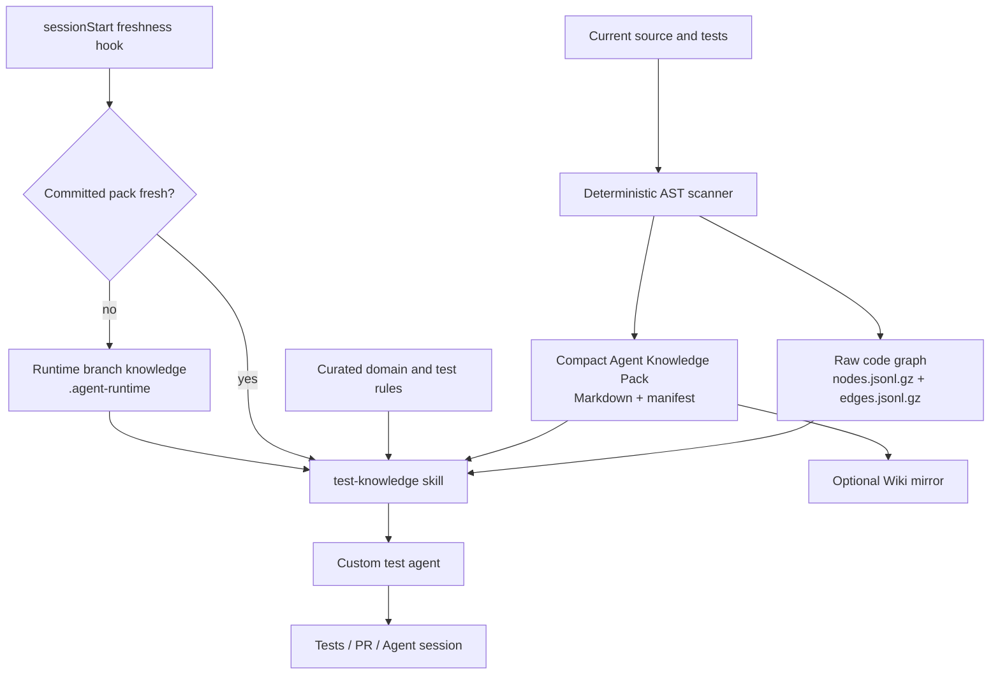

# Copilot Agent Knowledge Demo

An executable demonstration of a **shared, fresh, GitHub Copilot-readable knowledge loop** for test generation.

The repository implements the architecture discussed in the design:

- deterministic code graph as an intermediate artifact;
- compact repository knowledge projection for Copilot retrieval;
- branch-aware freshness handling;
- custom test-generation, knowledge-curation, and test-evaluation agents;
- a reusable Agent Skill for querying graph slices;
- a `sessionStart` hook that prepares the correct knowledge source;
- GitHub Actions that detect stale generated knowledge;
- an optional GitHub Wiki mirror for human browsing;
- shared Agent sessions as provenance rather than as the knowledge database.

## Core principle

```text
Current source code
      > branch-local runtime knowledge
      > committed generated knowledge
      > curated rules
      > Wiki / issues / PRs / session history
```

A shared Agent session records **why** an agent made a change. Versioned repository files carry the reusable knowledge to the next agent.

## Architecture



## What is implemented

| Concern | Implementation |
|---|---|
| Raw graph | `artifacts/codegraph/nodes.jsonl.gz`, `edges.jsonl.gz` |
| Agent-oriented projection | `docs/agent-knowledge/generated/` |
| Human-governed rules | `docs/agent-knowledge/curated/` |
| Freshness contract | source digest in `generated/manifest.json` |
| Current-branch delta | `.agent-runtime/knowledge/` generated on demand |
| Reusable procedure | `.github/skills/test-knowledge/` |
| GitHub custom agents | `.github/agents/` |
| Deterministic lifecycle hook | `.github/hooks/knowledge-freshness.json` |
| Always-on guidance | `.github/copilot-instructions.md`, `AGENTS.md` |
| Cloud-agent environment | `.github/workflows/copilot-setup-steps.yml` |
| Validation | `.github/workflows/ci.yml` |
| Knowledge update PR | `.github/workflows/refresh-agent-knowledge.yml` |
| Human portal | optional Wiki mirror workflow |

## Quick start

Requirements:

- Python 3.11 or later;
- GNU Make;
- Git.

Run the complete local demonstration:

```bash
make demo
```

Or run validation only:

```bash
make check
```

Expected result:

```text
3 tests pass
knowledge freshness: fresh
generated knowledge matches the current source tree
```

Prepare branch-aware Agent context:

```bash
make context
cat .agent-runtime/active-context.md
```

Query a focused code-graph neighborhood:

```bash
make query SYMBOL=PaymentService.authorize
```

Regenerate the shared baseline after source changes:

```bash
make knowledge
make check
```

## Publish to an existing empty repository

For an already-created repository whose default branch is `develop`:

```bash
./scripts/publish-existing-repository.sh tkhjp copilot-agent-knowledge-demo develop
```

The script requires an authenticated Git credential or GitHub CLI login on the machine
where it is run. It refuses to publish a dirty working tree.

## Demonstration scenario

The existing suite intentionally omits one case: **reusing an existing idempotency key**.

The behavior is recorded in the curated knowledge under the retrieval probe `PAYMENT_GRAPH_PROBE_7F31`. Use the following prompt in the GitHub **Agents** tab, VS Code Agent Mode, or Copilot CLI:

```text
Use the test-generator agent.
Add a test for repeated idempotency keys in PaymentService.authorize.
Before editing, report knowledge freshness, find PAYMENT_GRAPH_PROBE_7F31,
and query PaymentService.authorize at depth 1.
Modify tests only, then run the required checks.
```

A correct implementation should verify that the second call:

- returns the original `Payment`;
- does not call the gateway again;
- does not persist a second time.

More prompts are available in [`examples/prompts.md`](examples/prompts.md). A step-by-step GitHub UI walkthrough is in [`docs/agents-tab-demo.md`](docs/agents-tab-demo.md).

## Using the GitHub Agents tab

After the repository files exist on the default branch, follow [`docs/agents-tab-demo.md`](docs/agents-tab-demo.md). In summary:

1. Open GitHub's **Agents** page.
2. Select this repository as the task context.
3. Choose or explicitly request one of the repository agents:
   - `test-generator`;
   - `knowledge-curator`;
   - `test-evaluator`.
4. Start the task with one of the prompts in `examples/prompts.md`.
5. Review the resulting shared session and pull request.

The session is useful for reviewing prompts, commands, tool use, file changes, and rationale. A later agent should not depend on searching that session. It should read the committed knowledge files and current source instead.

## How freshness works

The committed manifest stores a deterministic digest over:

```text
src/**/*.py
tests/**/*.py
```

At Agent session start, the hook runs:

```bash
python3 -m tools.knowledge.prepare_context --hook
```

The hook performs the following logic:

```text
manifest digest == current source digest
    → use committed graph and generated Markdown

manifest digest != current source digest
    → regenerate graph and Markdown under .agent-runtime
    → tell the Agent to use the runtime paths
```

This avoids the circular problem of embedding the final Git commit SHA inside generated files that are themselves part of that commit. Runtime context still records the current `HEAD` for provenance.

## Knowledge design

### Raw graph

The graph contains nodes for modules, classes, functions, methods, and tests, plus static edges such as:

- `defines`;
- `calls`;
- `imports`;
- `inherits`.

It also records static `if` branch conditions and explicit raises. The graph is intentionally JSON Lines so other tools can stream or import it.

### Agent Knowledge Pack

Copilot should not receive the entire graph in every prompt. The generated Markdown projects only high-signal information:

- module responsibilities from source documentation;
- important symbols and source locations;
- static branch candidates;
- raised exceptions;
- outbound calls;
- direct test callers.

The skill then queries a narrow graph neighborhood for the target symbol.

### Curated knowledge

Human-owned rules remain separate from generated output:

```text
docs/agent-knowledge/curated/domain-rules.md
docs/agent-knowledge/curated/testing-policy.md
```

Automation never overwrites these files.

## Custom Agents

### `test-generator`

Uses fresh knowledge and graph slices to add focused tests. It defaults to modifying test files only and must report provenance.

### `knowledge-curator`

Regenerates deterministic artifacts and reviews the result. It does not hand-edit generated files.

### `test-evaluator`

Runs read-only test-quality analysis and distinguishes static graph evidence from runtime coverage.

## Agent Skill

The `test-knowledge` skill provides two executable helpers:

```bash
.github/skills/test-knowledge/prepare-context
.github/skills/test-knowledge/query-graph --symbol PaymentService.authorize --depth 1
```

Project skills in `.github/skills` can be discovered by Copilot when their description matches a task. The skill keeps the operational procedure beside the scripts it invokes.

## GitHub Actions

### CI

`CI` runs tests, checks manifest freshness, and regenerates artifacts in a temporary directory to prove the committed output is deterministic.

### Refresh Agent Knowledge

The manual workflow regenerates the knowledge pack and opens a pull request only when generated output changes. Repository settings must permit GitHub Actions to create pull requests and write contents.

### Wiki mirror

The Wiki workflow exports a flat, human-friendly view and pushes it to the repository Wiki. Before the first run, initialize the Wiki by creating one page in the GitHub UI.

The Wiki is deliberately downstream:

```text
Repository knowledge pack → Wiki mirror
```

Agents should read the same-repository knowledge files; people can browse the Wiki.

## Simulating stale branch knowledge

1. Change a production branch condition without regenerating knowledge.
2. Run:

   ```bash
   make freshness
   ```

   The command exits non-zero.

3. Run:

   ```bash
   make context
   ```

4. Inspect `.agent-runtime/active-context.md`. It points to runtime-generated graph and knowledge paths.
5. Run `make knowledge` when the branch is ready to update the shared baseline.

## Adapting this demo to a real repository

Replace the Python AST scanner with the graph producer appropriate to your stack, but retain the contracts:

1. deterministic raw artifact;
2. compact LLM-facing projection;
3. machine-readable manifest with source digest and generator/schema versions;
4. a query tool that returns a small graph slice;
5. branch-aware runtime regeneration;
6. current-code precedence;
7. CI that detects stale knowledge;
8. session provenance separated from reusable knowledge.

For large graphs, store the complete graph in a graph database, object store, or CI artifact and commit only the query client plus compact projections. Never place secrets, production payloads, customer data, or unrestricted logs in Copilot-readable knowledge.

## Repository layout

```text
.github/
  agents/                    custom Agent profiles (`*.agent.md`)
  hooks/                     deterministic session lifecycle hook
  instructions/              path-specific test guidance
  skills/test-knowledge/     reusable skill and scripts
  workflows/                 CI, refresh PR, optional Wiki mirror
artifacts/codegraph/         deterministic raw graph
docs/agent-knowledge/
  curated/                   human-owned rules
  generated/                 generated Copilot-oriented projection
src/payment_service/         demonstration production code
tests/                       demonstration tests
tools/knowledge/             scanner, renderer, freshness and query tools
```

## Security notes

- Review generated content before exposing it to organization-wide Copilot surfaces.
- Do not generate knowledge from secret files, production databases, private logs, or customer payloads.
- Keep shell-capable skills reviewed and versioned.
- Treat static analysis as evidence, not as authorization to change business behavior.

## License

MIT
