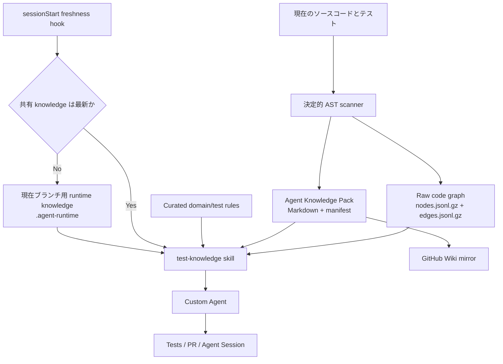

# Copilot Agent Knowledge Demo

[English README](README.md)

このリポジトリは、テスト生成を対象にした **共有可能・鮮度管理可能・GitHub Copilot から参照可能な知識ループ**の実行デモです。

## このデモで確認できること

- ソースコードから決定的に生成される code graph
- Copilot が読みやすい Markdown 形式の Agent Knowledge Pack
- 現在のブランチと共有知識の差分を検出する鮮度管理
- GitHub Copilot custom agents
- code graph を小さな範囲で検索する Agent Skill
- Agent session 開始時に知識コンテキストを準備する hook
- GitHub Actions による CI、知識更新、Wiki ミラー
- Agent Session を「知識本体」ではなく「実行履歴・監査証跡」として利用する設計

## 最初に理解すべき重要事項

`.github/agents/*.agent.md` をリポジトリに置いただけでは、GitHub の **Agents > All sessions** に Session は作成されません。

Session が作成されるのは、実際に GitHub Copilot cloud agent のタスクを開始したときです。

```text
Agent 定義を配置する
        ↓
まだ Session は存在しない
        ↓
GitHub の Agents タブからタスクを開始する
        ↓
初めて共有 Agent Session が作成される
```

このリポジトリで過去に作成された通常の GitHub Actions 実行や、API 経由で作成された Pull Request は Agent Session ではありません。

詳細な操作手順は次を参照してください。

- [GitHub Agents タブ実行ガイド（日本語）](docs/agents-tab-demo.ja.md)
- [英語版](docs/agents-tab-demo.md)

## 知識の優先順位

```text
現在の working tree のソースコード
      > 現在ブランチ用の runtime knowledge
      > コミット済み generated knowledge
      > 人が管理する curated rules
      > Wiki / Issue / PR / Session 履歴
```

現在のソースコードが常に最優先です。Session や Wiki の記述が現在のコードと矛盾する場合、現在のコードを正とします。

## アーキテクチャ



## 実装済みコンポーネント

| 対象 | 実装 |
|---|---|
| Raw code graph | `artifacts/codegraph/` |
| Agent 向け知識 | `docs/agent-knowledge/generated/` |
| 人が管理するルール | `docs/agent-knowledge/curated/` |
| 鮮度情報 | `docs/agent-knowledge/generated/manifest.json` |
| ブランチ用 runtime knowledge | `.agent-runtime/` |
| Agent Skill | `.github/skills/test-knowledge/` |
| Custom Agents | `.github/agents/` |
| Session hook | `.github/hooks/knowledge-freshness.json` |
| Repository instructions | `.github/copilot-instructions.md`, `AGENTS.md` |
| CI | `.github/workflows/ci.yml` |
| 知識更新 | `.github/workflows/refresh-agent-knowledge.yml` |
| Wiki ミラー | `.github/workflows/mirror-wiki.yml` |

## ローカル実行

必要環境:

- Python 3.11 以上
- GNU Make
- Git

一括デモ:

```bash
make demo
```

検証のみ:

```bash
make check
```

ブランチに対応した Agent context の準備:

```bash
make context
cat .agent-runtime/active-context.md
```

特定 symbol の graph 検索:

```bash
make query SYMBOL=PaymentService.authorize
```

共有 knowledge の再生成:

```bash
make knowledge
make check
```

## GitHub Agents タブで最初の Session を作る

1. GitHub でこのリポジトリを開きます。
2. **Agents** タブを開きます。
3. 新しい Agent task を開始します。
4. Repository に `tkhjp/copilot-agent-knowledge-demo` を選択します。
5. Base branch に `develop` を選択します。
6. Custom agent に `test-generator` を選択します。
7. 次の prompt を送信します。

```text
PaymentService.authorize で、同じ idempotency key に対して既存の Payment が
保存済みの場合の不足している unit test を追加してください。

編集前に以下を実行してください。

1. test-knowledge skill を使用する。
2. .agent-runtime/active-context.md の active knowledge mode を報告する。
3. PAYMENT_GRAPH_PROBE_7F31 を検索する。
4. PaymentService.authorize を depth 1 で graph query する。
5. 関連する generated module、test-impact、domain rules、testing policy を読む。
6. すべての知識を現在の実装と照合する。

変更対象は test のみにしてください。

以下を証明してください。

- 元の Payment object がそのまま返る。
- PaymentGateway.request_authorization は呼ばれない。
- PaymentRepository.save は再度呼ばれない。

make test と make check を実行してください。
Pull Request を作成し、summary に以下を記載してください。

- current Git HEAD
- active knowledge mode
- 使用した knowledge files
- 実行した graph query
- validation results
```

タスク開始後、**Agents > All sessions** に新しい Session が表示されます。

## Session で確認する項目

- `sessionStart` hook が実行されたか
- `.agent-runtime/active-context.md` が作成されたか
- `test-knowledge` skill が使用されたか
- `PaymentService.authorize` の graph query が実行されたか
- どの generated/curated knowledge file を読んだか
- どのテストを変更したか
- `make test` と `make check` が成功したか
- Session から branch または Pull Request が作成されたか

## Session と Knowledge の役割分担

| 対象 | 役割 | 権威ある情報源か |
|---|---|---:|
| 現在のソースコード | 現在の実装事実 | はい |
| Raw code graph | 機械的な静的関係 | はい |
| Agent Knowledge Pack | Agent 向けの共有知識 | はい |
| Branch runtime knowledge | 現在ブランチ用の最新投影 | はい |
| GitHub Wiki | 人向け閲覧、教育、ナビゲーション | いいえ |
| Agent Session | prompt、command、変更理由、監査証跡 | いいえ |

Agent 間の正式な handoff は Session URL ではなく、commit、branch、Pull Request、Knowledge Pack で行います。

## Wiki

Wiki は次で確認できます。

<https://github.com/tkhjp/copilot-agent-knowledge-demo/wiki>

Wiki は人向けのミラーです。Agent は同一リポジトリ内の次のファイルを優先して参照します。

```text
docs/agent-knowledge/generated/
docs/agent-knowledge/curated/
artifacts/codegraph/
```

## 他のリポジトリへ適用する場合

実際のプロジェクトでは Python AST scanner を対象言語に合った graph generator に置き換えます。ただし、次の契約は維持してください。

1. 決定的に生成できる raw artifact
2. LLM 向けの小さな knowledge projection
3. source digest、generator version、schema version を持つ manifest
4. 小さな graph slice を返す query tool
5. 現在ブランチ用 runtime knowledge
6. current source を最優先する規則
7. stale knowledge を検出する CI
8. Session provenance と再利用 knowledge の分離

## セキュリティ

- secret、顧客データ、本番 payload、機密ログを knowledge に含めないでください。
- generated knowledge を広く共有する前にレビューしてください。
- shell を実行できる Skill と Hook は必ず version control と review の対象にしてください。
- static graph は証拠候補であり、実行時 behavior の証明ではありません。

## License

MIT
