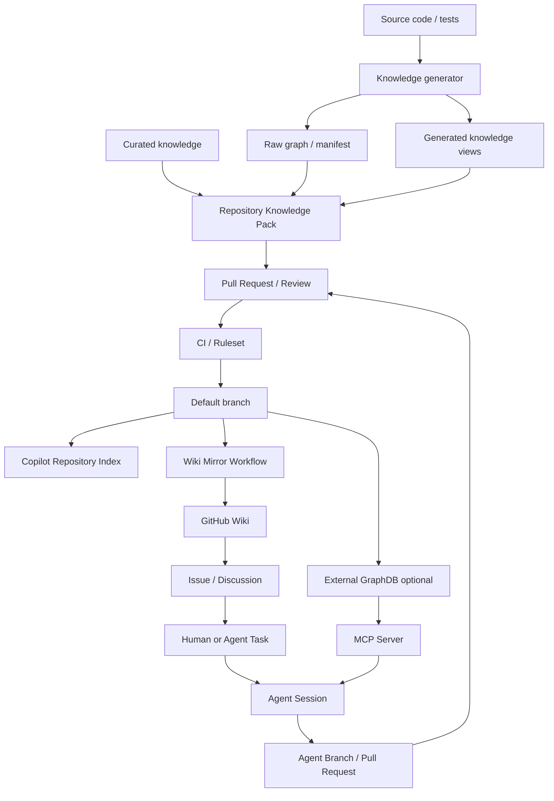

# GitHub ネイティブ機能を用いた共有プロジェクト知識の管理・連携設計

**対象:** code graph、test knowledge、architecture metadata、domain rule など、Repository 内で共有するプロジェクト知識  
**想定利用者:** 開発者、テスト担当者、GitHub Copilot 利用者、CI/CD 管理者、プロジェクト管理者  
**ステータス:** 実装・運用方針案  
**更新日:** 2026-07-27

---

## 1. Executive Summary

本設計の目的は、ある GitHub Repository に紐づく共有プロジェクト知識を、GitHub 内のどの機能に置き、どの機能を組み合わせて更新・確認・利用するかを明確にすることです。

最初に結論を示します。

```text
Repository 内の versioned knowledge files
        = 知識の Source of Truth

Git branch / commit / Pull Request / review / ruleset
        = 更新、差分確認、競合検出、承認

GitHub Actions
        = 生成、鮮度確認、整合性検証、Wiki 同期

GitHub Wiki
        = 人向けの可視化、閲覧、確認、feedback の入口

GitHub Copilot Agent
        = 知識の利用者、変更案の作成者、検証の実行者

Agent Session
        = prompt、command、変更理由、validation の実行履歴
```

推奨する基本構成は次です。

```text
Source code / tests
        ↓
Knowledge generator
        ↓
Repository knowledge files
        ↓
Pull Request + CI + review
        ↓ merge
        ├──────────────→ Copilot / Agent が Repository context として利用
        ├──────────────→ Wiki へ一方向同期
        └──────────────→ Issue / Discussion / Project で feedback と運用を管理
```

重要な設計判断は次のとおりです。

1. Wiki を知識の正本にはしない
2. Agent Session を知識データベースにはしない
3. Git は conflict を自動的に「解決」するのではなく、差分・履歴・競合を検出し、解決プロセスを提供する
4. generated artifact の conflict は手動編集せず、最新 branch 上で再生成する
5. Repository から Wiki への content 同期は一方向にする
6. Wiki からの feedback は Issue / Pull Request / Discussion に戻す
7. Agent は Repository knowledge を読み、branch と Pull Request を経由して変更する
8. 小規模・中規模 knowledge は Repository 内に置き、大規模 raw graph は別の保存方式を選択する
9. GitHub 内には任意の code graph を常時 query できる汎用 GraphDB はない
10. 大規模または高頻度更新の graph query が必要な場合は、Repository manifest と外部 GraphDB を MCP で接続する構成を検討する

---

## 2. GitHub 内で利用できる主要機能

本章では、共有 knowledge の保存・閲覧・更新・Agent 利用に関係する GitHub 機能を整理します。

GitHub の全機能を網羅するのではなく、今回の目的に直接関係する機能を対象とします。

---

## 2.1 GitHub Wiki

### 概要

GitHub Wiki は、Repository に紐づく長文ドキュメントを人が閲覧・編集するための画面です。

Markdown、リンク、画像、Mermaid diagram、sidebar、footer を利用できます。

Wiki は本体 Repository とは別の Git Repository として管理されます。

```text
main Repository
owner/repository.git

Wiki Repository
owner/repository.wiki.git
```

Wiki の変更にも commit history がありますが、本体 Repository の Pull Request workflow とは分離されています。

### 適している用途

- System overview の閲覧
- Module responsibility の確認
- Code graph の要約・可視化
- Test impact の閲覧
- Domain rule / testing policy の確認
- Onboarding
- 利用者向け navigation
- source file、Issue、Pull Request への導線

### 適していない用途

- raw code graph の全量保存
- 頻繁に更新される大量 generated files
- source code と同一 Pull Request での厳密な変更管理
- Agent が必ず参照する primary context
- arbitrary graph query
- Repository と Wiki の双方向同期

### 本設計での役割

```text
GitHub Wiki
    = 人向けの presentation / confirmation layer
    ≠ Source of Truth
```

Wiki の managed page は Repository から自動生成します。

利用者が修正を提案する場合は、Wiki を直接編集せず、対応する Issue または Repository file の Pull Request を作成します。

### Wiki の更新方式

```text
Repository knowledge merge
        ↓
GitHub Actions
        ↓
Wiki 用 Markdown export
        ↓
<repository>.wiki.git clone
        ↓
managed pages のみ置換
        ↓
Wiki commit / push
```

Wiki に人が自由記述する page を残す場合、workflow は全 Markdown を削除してはいけません。

推奨方式:

```text
Managed pages
- workflow が管理
- Repository から再生成
- 直接編集しない

Manual pages
- Wiki で人が管理
- workflow は削除・上書きしない
- Agent の正式な knowledge source にはしない
```

---

## 2.2 GitHub Copilot Agents / Agents tab / Agent Session

### 概要

GitHub Copilot cloud agent は、Repository を調査し、branch 上で変更し、test や lint を実行し、Pull Request を作成できる非同期 Agent です。

Agents tab では、Agent task の開始、進捗確認、steering、Session log の確認を行います。

### Agent Session で確認できるもの

- user prompt
- Agent response
- command
- tool usage
- read files
- changed files
- validation result
- branch / Pull Request
- token usage、Session duration

Cloud Agent Session は Repository の **Agents > All sessions** に共有され、Repository にアクセスできる利用者が閲覧できます。

### 適している用途

- knowledge を利用したテスト生成
- source / knowledge の調査
- graph query の実行
- generated knowledge の再生成
- Pull Request の作成
- validation の実行
- 実行理由と provenance の確認

### 適していない用途

- 長期 knowledge の正本
- 他 Agent が必ず検索できる共有データベース
- conflict resolution の最終承認
- 人の review を省略する仕組み

### 本設計での役割

```text
Agent
    = knowledge の利用者・変更提案者

Agent Session
    = 実行履歴・監査証跡

Repository commit / PR
    = 正式な handoff artifact
```

Agent を導入しても、Source of Truth と review rule は変更しません。

---

## 2.3 GitHub Copilot Spaces

### 概要

Copilot Spaces は、Repository、GitHub files、Pull Request、Issue、free text、画像、upload file などを集約し、Copilot Chat の回答 context として共有する機能です。

GitHub 上の source は更新に追随します。

### 適している用途

- 特定テーマの curated context
- 複数 file / Issue / PR を横断した Q&A
- onboarding context
- project area ごとの参照セット
- Repository を越えた利用者向け knowledge bundle

### 制約

- Source of Truth ではなく context collection
- IDE からの利用は GitHub MCP Server が必要
- IDE 利用時は repository context と uploaded files に制約がある
- deterministic bulk update、schema validation、conflict resolution の中心には向かない
- raw graph の query engine ではない

### 本設計での位置付け

Spaces は optional layer とします。

```text
Repository knowledge
        = 正本

Copilot Space
        = task / domain ごとの curated context view
```

Repository files を Space に追加することはできますが、Knowledge Pack 自体の version・review・merge は Repository で管理します。

---

## 2.4 Repository files / Git / Copilot Repository Index

### 概要

Repository 内の text files は Git で version 管理され、branch、commit、Pull Request、review、history、blame を利用できます。

Copilot Chat と Copilot cloud agent は、Repository の semantic index を利用して関連 code や text files を検索します。

### 適している用途

- compact な code graph artifact
- manifest
- generated Markdown
- curated rules
- schema
- query tool
- Agent instructions
- test metadata

### 強み

- source code と同じ commit / Pull Request で管理可能
- diff と history が明確
- Copilot Repository context に入りやすい
- branch ごとの状態を保持可能
- CI で deterministic validation が可能

### 制約

- 大容量 binary や高頻度更新 data は Repository を肥大化させる
- raw graph 全量をそのまま Copilot context に入れると noise が増える
- Git は record-level query database ではない

### 本設計での役割

小規模・中規模 knowledge の Source of Truth とします。

---

## 2.5 README / docs directory

README と `docs/` は、Repository の利用方法、architecture、governance、運用手順を version 管理する最も単純な方式です。

### 適している用途

- Repository entry point
- architecture decision
- operation guide
- human / Agent 共通の説明
- Wiki の source documents

### 本設計での役割

```text
README.md
    = 入口・navigation

docs/
    = versioned long-form source documents

Wiki
    = docs/ の human-facing mirror
```

---

## 2.6 Pull Request / Review / CODEOWNERS / Rulesets

### Pull Request

Knowledge change の差分確認、discussion、approval、merge を行います。

### CODEOWNERS

特定 path の責任者を定義し、Pull Request 作成時に自動で review request を送ります。

例:

```text
/docs/agent-knowledge/curated/ @org/domain-experts
/tools/knowledge/              @org/platform-team
/.github/agents/               @org/ai-governance
```

### Rulesets / Branch protection

- Pull Request 必須
- approval 必須
- CODEOWNER approval 必須
- status check 必須
- force push 禁止
- linear history 必須
- file path / extension / size restriction

などを enforcement できます。

### 本設計での役割

```text
Pull Request
    = knowledge change の review 単位

CODEOWNERS
    = knowledge owner の明示

Rulesets
    = review / CI を bypass できない governance
```

---

## 2.7 GitHub Actions

### 概要

GitHub Actions は、Repository event を trigger にして generator、validation、publish、notification を実行します。

### 適している用途

- code graph generation
- manifest generation
- freshness check
- schema validation
- deterministic output verification
- Pull Request check
- Wiki mirror
- Release / Package publish
- external GraphDB への snapshot publish

### 本設計での役割

GitHub Actions を knowledge lifecycle の automation engine とします。

```text
Git detects change
        ↓
Actions validates / generates / publishes
        ↓
PR and ruleset enforce the result
```

---

## 2.8 GitHub Actions Artifacts / Cache

### Actions Artifacts

Workflow run の出力を保存・download できます。

適している用途:

- CI debugging
- generated graph の確認
- Pull Request review 用 snapshot
- temporary report
- build-to-build handoff

制約:

- retention period がある
- long-term Source of Truth には向かない
- Agent が自動的に semantic search する context ではない

### Actions Cache

Dependency や build cache を高速化するための仕組みです。

適していない用途:

- knowledge の永続保存
- audit source
- versioned snapshot

Cache は eviction される可能性があるため、knowledge store にしません。

---

## 2.9 GitHub Issues

### 適している用途

- Wiki の誤り報告
- knowledge update request
- stale knowledge report
- generator bug
- missing graph edge report
- task assignment
- Agent task の入口

### 本設計での役割

Wiki からの feedback を actionable work に変換する入口とします。

```text
Wiki review
    ↓
Issue
    ↓
Human / Agent branch
    ↓
Pull Request
```

Issue form を用意し、次の情報を必須にすることを推奨します。

- 対象 Wiki page
- 対象 Repository file
- source commit / digest
- 問題の種類
- 期待する修正

---

## 2.10 GitHub Discussions

### 適している用途

- knowledge model の議論
- architecture の相談
- Q&A
- proposal
- team announcement
- 複数案の比較

### Issue との使い分け

```text
結論が未確定・議論中心
    → Discussion

実行すべき修正が明確
    → Issue

具体的な変更差分
    → Pull Request
```

Discussion で合意した内容は、Issue または Pull Request に変換して Repository に反映します。

---

## 2.11 GitHub Projects

Projects は Issue、Pull Request、draft item を table、board、roadmap として管理します。

### 適している用途

- knowledge backlog
- stale knowledge remediation
- graph coverage roadmap
- Agent task status
- owner / priority / target date
- cross-repository program tracking

### 適していない用途

- knowledge content の保存
- code graph の保存
- Agent primary context

Projects は workflow state を管理し、knowledge 本体は Repository に残します。

---

## 2.12 GitHub Pages

GitHub Pages は Repository から static site を公開する機能です。

### Wiki より Pages が適する場合

- custom navigation が必要
- search UI が必要
- graph visualization を実装したい
- API reference を生成したい
- 大規模 document site が必要
- Wiki の file soft limit を超える

### 制約

- static site であり、knowledge の正本ではない
- 更新は build / deploy workflow が必要
- private knowledge の公開条件を確認する必要がある

### 本設計での位置付け

```text
Wiki
    = 簡易な閲覧・確認

Pages
    = 高度な可視化・検索 UI
```

最初は Wiki を使い、UI 要件が増えた場合に Pages へ拡張します。

---

## 2.13 Releases / Release Assets

Release は tag に紐づく versioned snapshot を配布する仕組みです。

### 適している用途

- immutable な code graph snapshot
- versioned knowledge bundle
- tool binary
- schema package
- audit 用 snapshot

### 強み

- source tag と対応づけやすい
- large asset を添付可能
- download URL を提供可能

### 制約

- interactive query には向かない
- Copilot semantic index の対象ではない
- latest mutable knowledge の運用には向かない

---

## 2.14 Git Large File Storage (Git LFS)

Git LFS は large file の実体を専用 storage に置き、Repository には pointer を保存します。

### 適している用途

- large graph snapshot を working tree と一緒に checkout したい
- Git tag / branch と large artifact を対応づけたい

### 制約

- storage / bandwidth quota
- LFS fetch が必要
- text knowledge と比べて Copilot が直接利用しにくい
- frequent rewrite による transfer cost

Small/medium graph を normal Git、large graph を LFS にする選択肢がありますが、query 性能が必要な場合は GraphDB の方が適します。

---

## 2.15 GitHub Packages / Container Registry

GitHub Packages は package、container、dependency を versioned artifact として配布する仕組みです。

### 適している用途

- graph bundle を OCI image として version 管理
- query tool と schema を package 化
- organization 内の複数 Repository へ配布
- reproducible toolchain

### 制約

- human-readable knowledge portal ではない
- Agent は package pull / extract が必要
- arbitrary graph query database ではない

---

## 2.16 CodeQL database / Code Scanning

CodeQL CLI は codebase を query 可能な CodeQL database に変換できます。

### 適している用途

- supported language の static analysis
- code relationship query
- vulnerability / code quality analysis
- SARIF result を GitHub に表示

### 制約

- 主目的は code analysis / security
- license と利用可能 Repository の条件がある
- 独自 domain knowledge や test result の汎用 DB ではない
- team 向け knowledge UI ではない

CodeQL database は code graph generator の代替候補になり得ますが、Knowledge Pack、Wiki、PR workflow は別途必要です。

---

## 2.17 GitHub Dependency Graph

Dependency Graph は package manifest と lockfile、Dependency Submission API の data から、project dependency を表示します。

### 適している用途

- direct / transitive package dependencies
- vulnerability information
- SBOM export
- dependency review

### 適していない用途

- method call graph
- class inheritance graph
- arbitrary symbol graph
- test impact graph

したがって、今回の code graph 全体の保存先にはなりません。

---

## 2.18 Copilot Repository Custom Instructions

Repository 内に常時適用する方針を記載します。

主な file:

```text
.github/copilot-instructions.md
.github/instructions/*.instructions.md
AGENTS.md
```

### 適している用途

- knowledge の優先順位
- build / test command
- generated files の編集禁止
- Wiki は正本ではないという規則
- Agent が graph query を行う手順

### 適していない用途

- large knowledge content
- raw graph
- frequently changing facts の大量保存

Instructions は policy であり、knowledge database ではありません。

---

## 2.19 Prompt Files

Reusable prompt template を Repository に保存します。

```text
.github/prompts/*.prompt.md
```

### 適している用途

- knowledge refresh prompt
- test generation prompt
- Wiki review prompt
- graph query prompt

Prompt Files は実行入口を標準化しますが、Source of Truth にはしません。

---

## 2.20 Custom Agents

Custom Agent profile は、役割、tools、instructions、MCP server を定義します。

```text
.github/agents/test-generator.agent.md
.github/agents/knowledge-curator.agent.md
.github/agents/test-evaluator.agent.md
```

### 適している用途

- Test Generator
- Knowledge Curator
- Read-only Reviewer
- Graph Analyst
- Wiki Feedback Triage

Custom Agent は role definition であり、knowledge 本体は Repository / Space / external DB に置きます。

---

## 2.21 Agent Skills

Agent Skills は instructions、scripts、resources をまとめた reusable procedure です。

```text
.github/skills/test-knowledge/
├── SKILL.md
├── prepare-context
└── query-graph
```

### 適している用途

- graph query 手順
- freshness check
- schema validation
- Wiki publish validation
- standard report format

Skill は knowledge を利用する方法を定義します。

---

## 2.22 Copilot Hooks

Hooks は Agent lifecycle の特定時点で shell command を実行します。

例:

- `sessionStart`
- `preToolUse`
- `postToolUse`
- `agentStop`
- `sessionEnd`

### 適している用途

- Session 開始時の freshness check
- runtime knowledge generation
- prohibited path の保護
- validation の強制
- audit metadata の出力

Hook は enforcement / preparation mechanism であり、knowledge store ではありません。

---

## 2.23 Copilot Memory

Copilot Memory は Repository-level facts や user preference を Copilot が利用する機能です。

### 適している用途

- coding convention
- architecture fact
- build command
- frequently reused project rule

### 制約

- public preview
- user / organization policy に依存
- deterministic bulk import の中心には向かない
- 使われない memory は保持期限の影響を受ける
- current source と矛盾しないか validation されるが、versioned artifact ではない

Memory は補助 cache とし、正式な knowledge は Repository に置きます。

---

## 2.24 Model Context Protocol (MCP)

MCP は Copilot Agent から外部 system、database、tool に接続するための protocol です。

### 適している用途

- external GraphDB
- test result database
- document management system
- internal API
- cross-repository knowledge service

### 必要な設計

- read-only / write tool の分離
- tool allowlist
- Agent secrets / variables
- network / firewall
- audit log
- timeout / retry
- snapshot ID と source digest の対応

MCP は大規模 graph を Agent に提供する主要な拡張方式です。

---

## 2.25 GitHub API / Webhooks / GitHub Apps

### GitHub API

Repository files、Issue、Pull Request、Release、Package、Actions などを automation できます。

### Webhooks

push、Pull Request、Issue、workflow、package event を外部 system に通知できます。

### GitHub App

Organization scale の service identity として利用できます。

### 適している用途

- cross-repository knowledge sync
- external GraphDB publish
- Issue / PR automation
- organization-wide audit
- fine-grained permission

Single Repository 内では `GITHUB_TOKEN`、複数 Repository や長期 service では GitHub App を検討します。

---

## 2.26 Organization-level `.github` / `.github-private`

Organization 共通の custom agents は、Organization の `.github` または `.github-private` Repository に配置できます。

Organization custom instructions は Organization settings から設定できます。

### 適している用途

- 全 Repository 共通 Agent
- security / review standard
- standard skill / workflow
- issue / PR template
- contribution policy

### 制約

Project-specific knowledge は各 Repository に置き、Organization layer には共通 policy と reusable agent を置きます。

---

## 3. GitHub 機能の役割比較

| 機能 | 主な役割 | 長期保存 | Git diff / PR | 人向け UI | Copilot / Agent 利用 | Source of Truth 推奨 |
|---|---|---:|---:|---:|---|---:|
| Repository files | versioned knowledge | ○ | ○ | △ | semantic index / read tool | **○** |
| Wiki | 閲覧・確認 | ○ | 本体とは別 | **○** | primary context ではない | × |
| Copilot Agent | 実行・変更提案 | Session 単位 | branch / PR | ○ | 本体 | × |
| Agent Session | provenance | ○ | commit link | ○ | 他 Agent の正本ではない | × |
| Copilot Spaces | curated context | ○ | Source 側に依存 | ○ | GitHub Chat / MCP | × |
| Issues | correction / task | ○ | × | ○ | task context / API | × |
| Discussions | Q&A / proposal | ○ | × | ○ | API / context 補助 | × |
| Projects | status / roadmap | ○ | × | ○ | planning 補助 | × |
| Pull Requests | review / approval | ○ | **○** | ○ | Agent が作成可能 | 変更管理 |
| CODEOWNERS | owner / approval routing | ○ | ○ | △ | governance | policy |
| Rulesets | merge enforcement | ○ | 設定 | △ | Agent にも適用 | policy |
| Actions | generate / validate / sync | log retention | workflow file は○ | ○ | Agent output を検証 | automation |
| Actions Artifacts | temporary output | 期限あり | × | △ | download が必要 | × |
| Cache | build acceleration | eviction | × | × | 間接利用 | × |
| Pages | rich portal | ○ | source は○ | **○** | web fetch / API | × |
| Releases | immutable snapshot | ○ | tag 対応 | ○ | download が必要 | snapshot |
| Git LFS | large versioned file | ○ | pointer は○ | △ | checkout が必要 | 条件付き |
| Packages | versioned bundle | ○ | package version | △ | pull / extract が必要 | artifact |
| Repository index | semantic retrieval | GitHub 管理 | × | × | **○** | retrieval layer |
| Custom instructions | always-on policy | ○ | ○ | △ | **○** | policy |
| Custom agents | role / tools | ○ | ○ | Agent picker | **○** | definition |
| Skills | reusable procedure | ○ | ○ | △ | **○** | procedure |
| Hooks | lifecycle enforcement | ○ | ○ | × | **○** | mechanism |
| Memory | learned facts | policy / retention 依存 | × | 管理 UI | 一部機能で○ | × |
| MCP | external data bridge | 外部側 | config は○ | × | **○** | integration |
| CodeQL DB | code query database | bundle 可 | 通常は別 artifact | 専用 UI | tool 経由 | analysis store |
| Dependency Graph | package dependency view | GitHub 管理 | manifest は○ | ○ | API / security feature | 特定用途 |

---

## 4. 目的別の推奨編成

本章が実際の選択基準です。

---

## 4.1 目的: Repository 固有の共有 knowledge を正しく管理したい

### 推奨構成

```text
Repository files
+ Git branch / commit
+ Pull Request / review
+ CODEOWNERS
+ Rulesets
+ GitHub Actions CI
```

### 保存対象

```text
docs/agent-knowledge/generated/
docs/agent-knowledge/curated/
artifacts/codegraph/
manifest.json
schema/
query tool/
```

### 理由

- source code と同じ version で管理できる
- conflict と history を確認できる
- Agent と人が同じ file を参照できる
- CI で freshness を enforcement できる

---

## 4.2 目的: 利用者が knowledge を見やすく確認したい

### 推奨構成

```text
Repository knowledge
        ↓ Actions publish
GitHub Wiki
        ↓ feedback link
Issue / Pull Request
```

### Wiki を選ぶ条件

- Markdown 中心
- navigation と Mermaid で十分
- Repository ごとの portal
- 簡易な review / onboarding

### Pages を選ぶ条件

- full-text search が必要
- interactive graph visualization が必要
- custom theme / navigation が必要
- document 数が多い

---

## 4.3 目的: Wiki から利用者の確認・修正 feedback を得たい

### 推奨構成

```text
Managed Wiki page
    ├── Source file link
    ├── Source commit / digest
    ├── Edit source link
    ├── Report issue link
    └── Discussion link
```

### 使い分け

| Feedback | 使用機能 |
|---|---|
| 誤り・修正要求 | Issue |
| 具体的な修正 | Pull Request |
| 方針相談・Q&A | Discussion |
| 複数案件の進捗 | Project |

Content の双方向同期は行いません。

---

## 4.4 目的: generated knowledge を source change に同期したい

### 推奨構成

```text
source / test change
        ↓
feature branch
        ↓
knowledge generator
        ↓
generated files + manifest
        ↓
make check
        ↓
Pull Request
        ↓
required CI
        ↓
merge
        ↓
Wiki publish
```

### CI 必須条件

- source digest と manifest が一致
- generated output が deterministic
- schema validation 成功
- missing / extra artifact なし
- test 成功
- Wiki export 成功

---

## 4.5 目的: Agent に project knowledge を利用させたい

### 推奨構成

```text
Repository semantic index
+ .github/copilot-instructions.md
+ AGENTS.md
+ Custom Agent
+ Agent Skill
+ sessionStart Hook
+ narrow graph query tool
```

### Agent の参照順序

```text
1. current branch source code
2. current branch runtime knowledge
3. committed generated knowledge
4. curated knowledge
5. Space / Wiki / Issue / PR / Session history
```

### Agent に禁止すること

- Wiki managed page の直接更新
- raw graph 全量の prompt への投入
- stale manifest の無視
- generated conflict の手動修正
- review / CI の bypass

---

## 4.6 目的: Agent task の実行経緯を共有したい

### 推奨構成

```text
Agent Session
+ commit message の Session link
+ Pull Request provenance
+ CI result
```

Session は監査と review に利用します。

正式な knowledge handoff は次です。

```text
commit
+ branch
+ Pull Request
+ Repository knowledge files
+ manifest
```

---

## 4.7 目的: 大規模 code graph を保存したい

GitHub 内だけで選ぶ場合の比較:

| 保存方式 | 適する状況 | Query | Version | Agent 利用 | 注意点 |
|---|---|---:|---:|---|---|
| Normal Git | compact text / small graph | query tool | branch / commit | 高い | Repository 肥大化 |
| Git LFS | large snapshot | local tool | branch / tag | checkout 後 | quota / bandwidth |
| Release Asset | immutable snapshot | download 後 | tag / release | tool で取得 | latest mutable data には不向き |
| Package / OCI | versioned bundle | pull 後 | package version | tool で取得 | human browsing 不向き |
| Actions Artifact | temporary review | download 後 | run ID | 一時利用 | retention 期限 |
| CodeQL DB | supported code analysis | CodeQL query | DB bundle | 専用 tool | purpose / license 制約 |

### GitHub 内だけでは不足する条件

- interactive graph query
- node / edge の頻繁な更新
- cross-repository traversal
- low-latency API
- high concurrency
- large historical graph

この場合:

```text
Repository
├── manifest
├── compact knowledge views
├── snapshot ID / URI
├── schema
└── Agent Skill / query client

External GraphDB / Object Storage
└── complete graph

Copilot Agent
└── MCP server 経由で query
```

---

## 4.8 目的: 特定テーマの context をチームで共有したい

### 推奨構成

```text
Repository knowledge
+ relevant Issues / PRs
+ Copilot Space
```

Spaces は次の用途に限定します。

- API architecture
- test strategy
- migration plan
- incident context
- onboarding package

Spaces の source と Repository content が競合した場合は、Repository の current source を優先します。

---

## 4.9 目的: Organization 全体で共通 Agent / policy を共有したい

### 推奨構成

```text
Organization settings
    └── organization custom instructions

.github / .github-private Repository
    ├── organization custom agents
    ├── common templates
    └── governance documents

Each project Repository
    ├── project-specific knowledge
    ├── project-specific instructions
    └── local override / Agent Skill
```

### 原則

```text
Organization layer
    = 共通 policy / reusable agent

Project Repository
    = project-specific facts / graph / test knowledge
```

---

## 4.10 目的: Knowledge lifecycle の進捗を管理したい

### 推奨構成

```text
Issue
    = individual task

Project
    = status / owner / priority / target date

Discussion
    = 方針議論

Pull Request
    = actual change
```

Project に knowledge 本体をコピーしません。

---

## 5. 推奨する全体アーキテクチャ



---

## 6. Repository 内の推奨構成

```text
repository/
├── README.md
├── AGENTS.md
│
├── docs/
│   ├── architecture/
│   ├── governance/
│   └── agent-knowledge/
│       ├── generated/
│       │   ├── manifest.json
│       │   ├── system-overview.md
│       │   ├── modules/
│       │   └── test-impact/
│       └── curated/
│           ├── domain-rules.md
│           └── testing-policy.md
│
├── artifacts/
│   └── codegraph/
│       ├── nodes.jsonl.gz
│       └── edges.jsonl.gz
│
├── tools/
│   └── knowledge/
│       ├── generate
│       ├── query
│       ├── verify
│       └── export-wiki
│
└── .github/
    ├── copilot-instructions.md
    ├── instructions/
    ├── agents/
    ├── skills/
    ├── hooks/
    ├── ISSUE_TEMPLATE/
    ├── workflows/
    │   ├── ci.yml
    │   ├── refresh-knowledge.yml
    │   └── mirror-wiki.yml
    └── CODEOWNERS
```

---

## 7. Knowledge の分類

### 7.1 Generated knowledge

Source code、test、schema から generator が作成します。

例:

- code graph
- module summary
- branch inventory
- test impact
- coverage mapping

規則:

- 人が直接編集しない
- conflict は再生成する
- manifest と hash を持つ
- CI で deterministic output を検証する

### 7.2 Curated knowledge

人が判断して管理します。

例:

- domain rule
- testing policy
- naming convention
- exception policy
- security restriction

規則:

- Pull Request review 必須
- CODEOWNER approval を推奨
- Agent は提案可能だが、最終承認は人

### 7.3 Runtime knowledge

Current feature branch 用に一時生成します。

```text
.agent-runtime/
```

規則:

- Git commit しない
- current branch の作業中に利用
- merge 前に正式 knowledge へ再生成

---

## 8. Manifest と鮮度管理

Knowledge Pack は machine-readable manifest を持ちます。

```json
{
  "schema_version": 1,
  "generator_version": "1.1.0",
  "source_digest": "sha256:...",
  "source_files": {
    "src/payment_service/service.py": "sha256:...",
    "tests/test_payment_service.py": "sha256:..."
  },
  "graph": {
    "node_count": 30,
    "edge_count": 101,
    "artifacts": {
      "nodes.jsonl.gz": "sha256:...",
      "edges.jsonl.gz": "sha256:..."
    }
  },
  "knowledge_artifacts": {
    "modules/payment-service.md": "sha256:...",
    "test-impact/payment-service.md": "sha256:..."
  }
}
```

### Status

| Status | 条件 | 動作 |
|---|---|---|
| CURRENT | source digest が一致 | committed knowledge を利用 |
| STALE | source digest が不一致 | runtime knowledge または再生成 |
| BROKEN | artifact 不足、hash 不一致、schema error | 利用停止、再生成 |

---

## 9. 更新 Workflow

### 9.1 Human が source を変更する場合

```text
feature branch
    ↓
source / tests を変更
    ↓
make knowledge
    ↓
source + generated knowledge を commit
    ↓
make check
    ↓
Pull Request
    ↓
CODEOWNER / reviewer approval
    ↓
required checks
    ↓
merge
    ↓
Wiki publish
```

### 9.2 Human が curated knowledge を変更する場合

```text
curated Markdown を branch 上で変更
    ↓
Pull Request
    ↓
domain / test owner review
    ↓
merge
    ↓
Wiki publish
```

### 9.3 Agent を利用する場合

```text
Human starts Agent task
        ↓
Agent Session
        ↓
sessionStart freshness check
        ↓
CURRENT / RUNTIME knowledge 選択
        ↓
target symbol graph query
        ↓
source + generated + curated knowledge を確認
        ↓
Agent branch で変更
        ↓
knowledge 再生成
        ↓
make test / make check
        ↓
Pull Request
        ↓
human review / merge
        ↓
Wiki publish
```

### 9.4 Wiki feedback から更新する場合

```text
User opens Wiki page
        ↓
Source commit / status を確認
        ↓
Issue / Discussion / Edit source link
        ↓
Human or Agent task
        ↓
Repository Pull Request
        ↓
merge
        ↓
Wiki republish
```

---

## 10. Conflict 解決方針

| 対象 | Conflict 解決 |
|---|---|
| Source code | merge / rebase + review |
| Curated Markdown | three-way merge + human decision |
| Generated Markdown | target branch を取り込み再生成 |
| Raw graph | target branch を取り込み再生成 |
| Manifest | generator で再生成 |
| Wiki managed page | Repository を正とし再publish |
| Manual Wiki page | workflow の管理外。人が Wiki history で解決 |
| Agent branch | latest default branch に rebase 後、再生成と再検証 |

### 複数 Agent の場合

```text
Agent A branch → PR A → merge
Agent B branch → PR B
                 ↓
             rebase latest develop
                 ↓
             regenerate knowledge
                 ↓
             make check
                 ↓
             merge
```

---

## 11. Wiki 同期 Workflow の設計

### Trigger

- default branch への push / merge
- `docs/agent-knowledge/**` の変更
- Wiki source document の変更
- exporter の変更
- manual `workflow_dispatch`

### Processing

```text
1. default branch checkout
2. managed Wiki pages export
3. source commit / digest metadata 付与
4. Wiki Repository clone
5. 前回の managed page list を読み取る
6. managed pages のみ削除・置換
7. manual pages を保持
8. Wiki commit
9. Wiki default branch push
```

### Concurrency

```yaml
concurrency:
  group: mirror-agent-knowledge-wiki
  cancel-in-progress: true
```

### Page metadata

```markdown
> **管理方式:** Repository から自動同期される managed page
> **Source repository:** `owner/repository`
> **Published from commit:** `abcdef1`
> **Source digest:** `sha256:...`
> **Generator version:** `1.1.0`
> **Status:** CURRENT
> **Source file:** `docs/agent-knowledge/generated/...`
> **修正方法:** Wiki を直接編集せず、Issue または Pull Request を作成してください。
```

### Publish failure

Wiki は downstream view なので、publish failure が Source of Truth を壊すことはありません。

- Repository merge は保持
- workflow failure を通知
- manual rerun
- 次回は最新 default branch から再publish

---

## 12. Agent の構成

### Test Generator Agent

- freshness check
- target symbol query
- current source read
- relevant knowledge read
- test modification
- knowledge regeneration
- validation
- provenance report

### Knowledge Curator Agent

- source change analysis
- generator execution
- graph / view diff review
- schema / secret / size check
- Pull Request creation

### Test Evaluator Agent

- test quality evaluation
- graph / test impact comparison
- missing branch analysis
- read-only report

### Wiki Feedback Triage Agent

- knowledge feedback Issue の分類
- source file / generated file の特定
- source bug / generator bug / curated rule の区分
- appropriate owner / label の提案

---

## 13. Agent Pull Request の必須 provenance

```markdown
## Knowledge provenance

- Base branch: `develop`
- Source digest: `sha256:...`
- Knowledge status: `CURRENT` / `RUNTIME`
- Generated files used:
  - `docs/agent-knowledge/generated/modules/...`
  - `docs/agent-knowledge/generated/test-impact/...`
- Curated files used:
  - `docs/agent-knowledge/curated/...`
- Graph query:
  - symbol: `PaymentService.authorize`
  - depth: `1`
- Validation:
  - `make test`
  - `make check`
```

---

## 14. 本 Demo での採用状況

| 機能 | 状態 | 用途 |
|---|---|---|
| Repository Knowledge Pack | 実装済み | Source of Truth |
| Raw code graph | 実装済み | compact graph sample |
| Manifest / freshness | 実装済み | CURRENT / STALE 判定 |
| GitHub Actions CI | 実装済み | test / deterministic verification |
| Wiki mirror | 実装済み | human portal |
| Custom Agents | 実装済み | generator / curator / evaluator |
| Agent Skill | 実装済み | context preparation / graph query |
| Hook | 実装済み | sessionStart freshness |
| Agent Session | Agent task 実行後に生成 | provenance |
| Issues / Issue Form | 追加候補 | Wiki feedback |
| Discussions | optional | proposal / Q&A |
| Projects | optional | knowledge backlog |
| CODEOWNERS | 追加推奨 | knowledge owner review |
| Rulesets | Repository setting 推奨 | required PR / CI / approval |
| Pages | 未採用 | rich UI が必要な場合 |
| Spaces | optional | curated Copilot context |
| Memory | optional | auxiliary repository facts |
| MCP / external GraphDB | 未採用 | large graph mode |
| Releases / LFS / Packages | 未採用 | large immutable artifact mode |
| CodeQL DB | optional alternative | static code query |

---

## 15. 推奨導入順序

### Phase 1: Repository-contained baseline

1. Repository knowledge structure
2. manifest / generator
3. Pull Request / CI
4. Wiki mirror
5. Issue feedback path
6. CODEOWNERS / Rulesets

### Phase 2: Agent utilization

1. custom instructions
2. custom agents
3. Agent Skills
4. hooks
5. first shared Agent Session
6. provenance template

### Phase 3: Scale-out

1. Spaces for curated cross-document context
2. Organization-level agents / instructions
3. Pages for rich visualization
4. Release / LFS / Packages for large snapshots
5. External GraphDB + MCP for interactive large graph query
6. GitHub App for cross-repository automation

---

## 16. 最終判断

### Repository 内で管理すべきもの

- source code と直接対応する knowledge
- compact graph
- manifest
- generated views
- curated rules
- Agent instructions / skills / hooks
- query client

### Wiki で提供すべきもの

- 人が読む system / module overview
- graph の要約・diagram
- test impact
- status / source metadata
- Issue / PR / Discussion への導線

### Agent が行うもの

- knowledge retrieval
- narrow graph query
- source / test / knowledge change
- regeneration
- validation
- Pull Request creation

### GitHub 内だけでは不足するもの

- generic interactive GraphDB
- large cross-repository graph query
- high-frequency concurrent node / edge updates
- long-term large historical graph store

これらが必要になった時点で、external GraphDB / object storage と MCP を追加します。

---

## 17. 公式仕様参照

- [Documenting your project with wikis](https://docs.github.com/en/communities/documenting-your-project-with-wikis)
- [Adding or editing wiki pages](https://docs.github.com/en/communities/documenting-your-project-with-wikis/adding-or-editing-wiki-pages)
- [Use Copilot agents](https://docs.github.com/en/copilot/how-tos/copilot-on-github/use-copilot-agents)
- [Managing agent sessions](https://docs.github.com/en/copilot/how-tos/copilot-on-github/use-copilot-agents/manage-and-track-agents)
- [About GitHub Copilot Spaces](https://docs.github.com/en/copilot/concepts/context/spaces)
- [Using GitHub Copilot Spaces](https://docs.github.com/en/copilot/how-tos/provide-context/use-copilot-spaces/use-copilot-spaces)
- [Indexing repositories for GitHub Copilot](https://docs.github.com/en/copilot/concepts/context/repository-indexing)
- [Adding repository custom instructions](https://docs.github.com/en/copilot/how-tos/copilot-on-github/customize-copilot/add-custom-instructions/add-repository-instructions)
- [Copilot customization cheat sheet](https://docs.github.com/en/copilot/reference/customization-cheat-sheet)
- [Creating custom agents](https://docs.github.com/en/copilot/how-tos/copilot-on-github/customize-copilot/customize-cloud-agent/create-custom-agents)
- [About agent skills](https://docs.github.com/en/copilot/concepts/agents/about-agent-skills)
- [Customize agent workflows with hooks](https://docs.github.com/en/copilot/how-tos/copilot-on-github/customize-copilot/customize-cloud-agent/use-hooks)
- [About GitHub Copilot Memory](https://docs.github.com/en/enterprise-cloud@latest/copilot/concepts/agents/copilot-memory)
- [Configure MCP servers for your repository](https://docs.github.com/en/copilot/how-tos/copilot-on-github/customize-copilot)
- [About issues](https://docs.github.com/en/issues/tracking-your-work-with-issues/learning-about-issues/about-issues)
- [GitHub Discussions](https://docs.github.com/en/discussions)
- [About Projects](https://docs.github.com/en/issues/planning-and-tracking-with-projects/learning-about-projects/about-projects)
- [Managing rulesets](https://docs.github.com/en/repositories/configuring-branches-and-merges-in-your-repository/managing-rulesets)
- [About code owners](https://docs.github.com/en/repositories/managing-your-repositorys-settings-and-features/customizing-your-repository/about-code-owners)
- [GitHub Actions artifact retention](https://docs.github.com/en/repositories/managing-your-repositorys-settings-and-features/enabling-features-for-your-repository/managing-github-actions-settings-for-a-repository)
- [About releases](https://docs.github.com/en/repositories/releasing-projects-on-github/about-releases)
- [Introduction to GitHub Packages](https://docs.github.com/en/packages/learn-github-packages/introduction-to-github-packages)
- [CodeQL CLI](https://docs.github.com/en/code-security/concepts/code-scanning/codeql/codeql-cli)
- [Dependency graph](https://docs.github.com/en/code-security/concepts/supply-chain-security/dependency-graph)
- [Preparing organization custom agents](https://docs.github.com/en/copilot/how-tos/administer-copilot/manage-for-organization/prepare-for-custom-agents)
